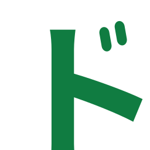

# Kōdo

<p align="center">
    
</p>

[](https://github.com/thehiddenone/kodo/actions/workflows/ci.yml)
[](https://marketplace.visualstudio.com/items?itemName=StanislavMorozov.vs-kodo)

**Kōdo** (コード) is a build system that converts natural language into working code through a multi-agent LLM workflow — designed from the ground up to run on your own hardware, model included. That's the pitch. How much of it actually holds up today, versus how much is still a plan with code attached, is spelled out plainly in [Status](#status) at the bottom — read that before you get your hopes up.

## Concept

Most AI coding tools live or die by the quality of your prompt — if you know exactly what you want and how to ask for it, they shine; if you don't, you get something that looks plausible but misses the mark. Kōdo is built on the belief that the bar shouldn't have to be that high.

Rather than expecting you to front-load every right detail, Kōdo asks. A structured multi-agent workflow interviews you, probes your goals, and tries to surface the decisions you didn't know you needed to make — turning a rough idea into a rich, precise specification before a single line of code gets written. Those specs are first-class artefacts, versioned and owned by you, living alongside your source code.

There's a north star behind that: the spec as source of truth, code as its derived artifact, update-the-spec-and-Kōdo-handles-the-rest. It's a real direction, not a slogan, but it's a distant one — right now Kōdo helps you build a spec and works from it for a pass, not something you'd yet trust to keep spec and code honestly in sync over a project's whole life. Better to say that plainly here than let the pitch imply more than the software currently does.

The second core idea: none of this should require a subscription, an API key, or shipping your code to someone else's datacenter. Kōdo runs as a Visual Studio Code extension talking to a local Python server, and that server drives an open-weight model on your own GPU exactly as readily as it drives a hosted API. With a cloud model, nothing leaves your machine except the LLM API call itself. With a local model, nothing leaves your machine, period. Whether what comes back is any good is a separate question, and one this README is not going to dodge — see [Small models, dense contexts](#small-models-dense-contexts) below.

To keep its promises checkable, Kōdo currently sticks to backend software — logic, APIs, data pipelines — where correctness can be verified by tests instead of a human squinting at a UI. That's a scope limit, not a flex. UI work is genuinely harder to grade automatically, and shipping something that only *looks* done isn't the goal here.

## Local LLMs are first-class (they're still small models, though)

Kōdo treats a GGUF running under llama.cpp the same way it treats a hosted API — same agents, same tools, same approval gates — and does the unglamorous plumbing work that makes that actually true, rather than just asserting it:

- **A curated model catalogue.** Two dozen ready-to-install builds across Qwen 3.6 (27B dense and 35B-A3B MoE), Qwen3-Coder-Next 80B, GPT-OSS 120B and 20B, Qwen 3.5 9B, Gemma 4 26B, and Ornith 1.0 35B-A3B — each entry carrying its quant spec, on-disk size, and hand-written hardware guidance for both discrete-GPU PCs and Apple Silicon Macs.

- **Hardware-fit detection.** Kōdo reads your GPU VRAM and system RAM and checks every catalogue entry against them *before* you download — a red warning when a build won't run on your machine, a yellow one when it'll crawl at large contexts. The sizing accounts for llama.cpp's ability to split a model between GPU and system RAM (per-layer offloading for dense models, expert offloading for MoE models), so a modest consumer GPU is judged by what it can actually run, not by VRAM alone.

- **A real download manager.** Pause and resume that survive restarts and crashes, split-shard GGUFs handled automatically, live progress across every open window, and background failures that get surfaced instead of silently swallowed. See [`doc/LOCAL_MODEL_MANAGER.md`](doc/LOCAL_MODEL_MANAGER.md).

- **Agentic reliability hardening.** A local model's tool calls are parsed out of its raw token stream, and that format slips in ways a hosted API's basically never does. Kōdo launches `llama-server` with grammar-constrained tool parsing, salvages tool calls the model emitted as plain text instead (behind a user confirmation — auto-salvaging silently is exactly the kind of shortcut that bites you later), and strips stray `<think>` tags out of the transcript. The difference between a demo and a 200-tool-call session that survives to the end.

- **Bring your own.** Any HuggingFace GGUF, any local model file, or the URL of a llama-server you already run elsewhere, plus a binary override to point Kōdo at your own `llama-server` build.

None of the above makes a small model smarter. It just stops bad tooling from being the reason a session dies before the model even gets to show what it's got. Those are two different problems, and this section only solves one of them.

Prefer a hosted model? Anthropic, OpenAI, Meta, Google, Alibaba, and DeepSeek's model families are all supported as first-class alternatives, with per-agent effort tiers and prompt caching (automatic on OpenAI's, Meta's, Google's, Alibaba's, and DeepSeek's side, explicit breakpoints on Anthropic's) keeping multi-agent token costs down. Meta additionally offers an opt-in "contributor" tier — heavily discounted pricing in exchange for permission to train future Meta models on your traffic, off by default and gated behind a warning in the settings panel. Either way, the server, your files, your specs, checkpoints, and session history stay on your machine.

Anthropic, OpenAI, Meta, Google, Alibaba, and DeepSeek are the first six cloud providers, not the last: support for Kimi is planned, along with OpenRouter as an aggregator. Further out is a hybrid mode that treats local and cloud as one pool — a small local model triages each step of the workflow, escalating to a frontier model only when the work genuinely needs one and keeping everything routine on your own GPU. "Planned" and "further out" are doing a lot of lifting in that paragraph; nothing above is implemented yet.

## Small models, dense contexts

Are local models good enough for serious, multi-step engineering? Honestly — not on their own, and probably not ever at the very top end. A 9–35B open-weight model is not going to out-think a frontier hosted model like Fable or whatever else is currently burning a small country's power grid in a datacenter somewhere. Anyone telling you a local model is secretly just as good is selling you something. Kōdo doesn't make that claim. What it tries to do instead is close as much of the gap as engineering effort can close — not erase it, close it. The multi-agent workflow isn't just quality control, it's context engineering for models that run on hardware you already own, because that's the one lever actually available at this budget.

A monolithic coding agent accumulates one enormous transcript and re-reads all of it on every turn. Long context is exactly where local models hurt most: quality degrades, and the KV cache eats the very memory the weights need. Kōdo tries never to put a model in that regime. Each sub-agent starts from a clean context containing only the distilled inputs for its one job — the spec section under review, the test plan to implement, an investigation summary — does that job, returns a structured, schema-validated result, and exits. Nothing accumulates, at least not by design. Every context stays small and dense, which is roughly where a 9–80B open-weight model does its best work, or at least its least embarrassing work. When a long-running session does grow anyway, context compaction kicks in, sized to the active model's real context window.

The second half of the bet is verification. Kōdo writes tests from requirements before any implementation exists, pairs every author agent with a critic, and defines "done" as "the tests pass." The idea is to trade *right on the first try* — what you pay frontier-model prices for — for *verifiably right after enough iteration*. On your own GPU, iteration costs electricity and your patience instead of tokens. Whether that trade actually pays off end-to-end, on real projects, is precisely the part that's still unproven. See [Status](#status). This section is a description of the strategy, not a receipt showing it worked.

## Two ways to work

**The guided pipeline** takes a green-field idea to a tested system through staged specification and review — the full workflow below. It's the more ambitious of the two modes, and, right now, the one to trust the least: it's mostly untested end-to-end, and it has not yet produced a delivery good enough to hold up as proof the approach works. The steps are real, they run, the code exists — what's missing is a track record. Treat it as something to watch and poke at, not something to put on a deadline.

**The Problem Solver** is the everyday entrance, and the mode actually carrying weight day to day: point it at any codebase (Kōdo-built or not) and ask for a change, a fix, or a written investigation. It orchestrates dedicated Investigator, Planner, and Developer sub-agents for substantial work, and just does small asks directly — no ceremony for a one-file change.

Worth being explicit here, because the two paragraphs above could easily read as "same rigor, different scope" — they're not. Guided mode's TDD-by-construction and adversarial author/critic review are specific to the guided pipeline; the Problem Solver doesn't run either of those today. It plans, via its own Planner sub-agent, and implements, via its Developer sub-agent, more directly — no test-first mandate, no critic gating the diff before it's considered done. That's a real capability gap, not a lighter flavor of the same thing, and it's open work rather than a footnote.

The two modes are complementary rather than parallel, at least on paper: guided mode is planned project work, the Problem Solver is for what needs handling right now. The roadmap wants to bring them together — the Problem Solver eventually learning to operate on guided projects, updating the spec alongside the code so an urgent fix never leaves the two out of sync. "Roadmap" here means exactly that: not built yet.

## The guided workflow

This is the pipeline as designed, and as it exists in code — worth repeating that "exists in code" and "reliably produces something good" are not the same claim; see the section above.

1. **Init** — `Kodo: Init Project` lays down `.kodo/` (with the `kodo.md` manifest), `specs/`, `src/`, and `test/`.
2. **Prompt** — describe your idea in the WebView. The Narrative Author drafts a top-level description, optionally after a preliminary investigation of your existing code and the web.
3. **Architecture** — the Architect carves the work into components and emits a dependency graph used later for integration-test scheduling.
4. **Per-component specs** — for each component, author/critic pairs iterate on Requirements, then Functional Design, then a Test Plan, with an approval gate between every stage.
5. **Tests first** — the Test Coder produces failing tests from the test plan; nothing is implemented yet.
6. **Implementation** — the Coder iterates until every test passes; the Code Critic gates the diff.
7. **End-to-end** — where the Architect deems it applicable, an end-to-end test plan and suite assemble the whole system behind declared seams and verify it as a black box.
8. **Final approval** — the workflow closes and you review the full checkpoint history. Getting here cleanly, on a real project, is the part still being worked out — see above, again, because it's the honest answer and it doesn't get less true from repetition.

At each gate you can **Agree** (proceed) or **provide feedback** (re-run only the responsible author/critic pair with your input). A global **STOP** is available at all times. **Autonomous mode** runs the workflow unattended — agents resolve uncertainty with documented assumptions instead of questions, while the security layer stays live.

## A Kōdo project's structure

A Kōdo project keeps its specifications and documentation separate from the code generated from them.

```text
specs/    specification and documentation files — narrative, responsibilities, per-component specs
src/      generated source code — all components and modules, including entry points
test/     generated unit tests, integration tests, and the end-to-end test
.kodo/    Kōdo working state — kodo.md manifest, checkpoint mirror (git), settings, logs
```

Loosely, specs are meant to relate to generated code the way source relates to a compiled binary — that's the intent, not yet a settled property of the system (see [Concept](#concept)). Humans own `specs/` and approve everything that lands in `src/` and `test/`.

## Key features

The list below describes what's implemented, not a review score of how well each thing works in practice — that's what [Status](#status) is for.

**Multi-agent workflow** — two entry agents, the Kōdo guide and the Problem Solver, each drive their own slice of a shared pool of twenty-plus specialised sub-agents, and the two slices don't overlap much. The guide runs author/critic pairs that gate output until quality is acceptable (capped at five iterations before escalating); the Problem Solver runs standalone Investigator, Planner, and Developer sub-agents instead. Toolchain agents are the part actually shared by both.

**TDD by construction (guided mode)** — tests are written from requirements before any implementation exists. The Coder's loop terminates when tests pass; if a requirement isn't testable, the Test Designer is supposed to push back during specification, before code is written. The Problem Solver has no equivalent test-first mandate — see [Two ways to work](#two-ways-to-work).

**Behaviour testing, not implementation testing (guided mode)** — generated tests assert observable outcomes rather than call counts or internal mocks. LLMs tend toward brittle, implementation-coupled tests left to their own devices; the Test Design Critic exists specifically to fight that tendency.

**Approval gates with feedback loops (guided mode)** — every stage ends at a gate. Agree to proceed, or provide feedback that re-runs only the responsible agent pair — never the entire workflow. Nothing lands in `src/` or `test/` until you approve it.

**Full control over changes via the git mirror** — every mutating step lands as a commit in a shadow git mirror inside `.kodo/checkpoints/`, without touching (or requiring) a repository of your own. Roll the whole workspace back to any point in history and forward again — nothing is destructive — or undo and redo an individual change's files independently, and diff between any two states. Nothing an agent does is beyond your reach to inspect or reverse. See [`doc/CHECKPOINTS.md`](doc/CHECKPOINTS.md).

**Crash-safe sessions** — every session persists as it runs and resumes exactly where it stopped, even mid-turn, after a crash or a window reload. Multiple sessions run in parallel tabs, across VS Code windows, against one shared local server. See [`doc/SESSIONS.md`](doc/SESSIONS.md).

**Security layer** — every tool call passes through a per-call allow-or-ask judgement driven by the Tool Control posture (permissive / defensive / smart). Smart mode statically analyzes shell commands for targets outside the workspace and runs an LLM intent judge over high-impact calls; anything it can't clear raises a permission prompt. See [`doc/SECURITY.md`](doc/SECURITY.md).

**Web-capable research** — an agent-driven web search that paces its own discovery/read/synthesis loop, with browser-backed and static page extraction. See [`doc/WEB_SEARCH.md`](doc/WEB_SEARCH.md).

**Quantified quality control** — Kōdo's agent prompts aren't tuned by gut feel alone. An internal harness, `kodo.validator`, drives real sessions through the real server, protocol, tools, and gates — no VS Code, no human — and records a complete transcript for scoring, giving system-prompt changes a measurable quality signal instead of vibes. This matters doubly for local models: open-weight families differ enough in behaviour that a prompt suited to one can fail another, so the harness is what makes per-model prompt curation tractable at all. See [`doc/VALIDATOR.md`](doc/VALIDATOR.md).

**Visual Studio Code extension** — streamed agent output, file diffs in VS Code's native diff editor, approval and permission prompts, cumulative cost, checkpoint controls, and a Local Inference Settings panel for browsing, downloading, and managing local models — all without leaving the IDE.

**Narrow extension surfaces** — LLM providers are plugins (Anthropic, OpenAI, Meta, Google, Alibaba, DeepSeek, and llama.cpp today); agents and language toolchains are markdown-defined sub-agents, so adding a role or an ecosystem is meant to be a prompt plus a schema, not an engine change. See [`doc/ADDING_A_SUBAGENT.md`](doc/ADDING_A_SUBAGENT.md).

## Building the project

The project uses [hatch](https://hatch.pypa.io) for environment and build management. The version scheme is `major.minor.build` (e.g. `0.1.7`) — there's no separate patch slot, the build number *is* the third component. It lives in the `build_number` file, gets stamped into `pyproject.toml` and `__init__.py` at build time, and is auto-incremented after a successful `hatch run build`. Pushing that incremented `build_number` to `main` is what actually ships a release, via two chained GitHub

Actions workflows:

1. [`ci.yml`](.github/workflows/ci.yml) runs `hatch run check` on every push and PR to `main` — this is the badge at the top of this README. A second job in the same workflow, gated on that check passing, diffs the push against its previous commit; only if `build_number` changed does it `hatch build` the wheel and upload it as an artifact. One check per push either way — a plain push and a release push both run `hatch run check` exactly once.
2. [`publish-kodo.yml`](.github/workflows/publish-kodo.yml) triggers on completion of `ci.yml`. If that run failed, or succeeded without producing an artifact (i.e. it wasn't a `build_number` push), there is nothing to publish and it's a no-op. Otherwise it downloads the artifact and publishes it to PyPI.

There's no separate manual "now go publish" step — bumping the file *is* the trigger,
which is a little unsettling if you think about it too hard, so it's best not to.

### Development cycle

```text
code change  →  build  →  test  →  commit  →  hatch run build  →  push to main  →  CI publishes to PyPI
```

| Command | What it does |
| --- | --- |
| `hatch run fmt` | Auto-format source with ruff. |
| `hatch run lint` | Lint source with ruff. |
| `hatch run typecheck` | Type-check with mypy. |
| `hatch run test` | Run the test suite with pytest. |
| `hatch run check` | Run fmt, lint, typecheck, and tests — no build. |
| `hatch build` | Quick wheel + sdist using the current version in `pyproject.toml`. Does **not** increment `build_number` or run checks. Use during development to verify the build. |
| `hatch run check-version` | Sync `__version__` in `__init__.py` from `pyproject.toml`. |
| `hatch run build` | Full release pipeline: stamp version, fmt, lint, typecheck, test, build, post-increment `build_number`. |

The `build_number` file contains the build number for the work currently in progress. Commit your changes *before* running `hatch run build` — this way the committed source matches the build number recorded in the repository. `hatch run build` is intended to be the final step once code changes are done, tests are green, and everything is committed. It produces a numbered wheel, then advances `build_number` so the repository is already pointing at the next iteration.

If a `kodo-vsix` checkout sits alongside this repo (`../kodo-vsix`), `scripts/post_build.py` also pins its `package.json` `version` to the `py-kodo` version just built — `kodo-vsix` installs `py-kodo` from PyPI pinned to its own extension version (see `kodo-vsix/src/uv-setup.ts`), so the two must always move together. No-op if that checkout isn't present.

This lockstep pinning is also what the extension's runtime upgrade check relies on: on every activation where a venv already exists from a previous run, `kodo-vsix` compares the installed `py-kodo` version against its own and upgrades it to match if the extension is now ahead (e.g. after a VS Code Marketplace auto-update) — see `planKodoUpgrade`/`ensureKodoEnvironment`/`maybeUpgradeKodo` in `kodo-vsix/src/uv-setup.ts`. A failed upgrade never blocks startup; the server just launches on whatever `py-kodo` version is already installed.

The check runs *before* the launcher decides to reuse an already-running singleton server, because that server is the obstacle: it runs Python out of the very venv being upgraded. When an upgrade is due, `kodo-vsix` sends the `server.shutdown` command ([doc/WS_PROTOCOL.md §7.6g](doc/WS_PROTOCOL.md)), waits for the process to exit, upgrades, and launches a fresh server on the new backend. Other windows reconnect to it on their own.

## Status

Early-stage, and that word is carrying its actual meaning here, not the usual GitHub-README hedge that means "basically done, but legally we have to say this."

Kōdo is on PyPI: **[`pip install py-kodo`](https://pypi.org/project/py-kodo/)**. Don't read anything into that. Installing it today gets you a package with no exposed interface and nothing directly useful to point at — there's no polished console mode yet. One is planned, but it's genuinely TBD, not a polite way of saying "basically done." The real reason this is published at all right now is so the VS Code extension has something to `pip install` when it provisions `kodo-server` in the background. If you're a human deciding whether to `pip install py-kodo` yourself: not yet, there's nothing here for you directly — what you want instead is the [Kōdo extension on the VS Code Marketplace](https://marketplace.visualstudio.com/items?itemName=StanislavMorozov.vs-kodo), which installs and provisions this package for you.

Guided mode — the full staged pipeline described above — is mostly untested end-to-end and, as of this writing, has not produced a delivery good enough to point at and say "see, this is why you'd use it." The plumbing is real: the stages run, the gates work, the checkpoints land. What's missing is proof that chaining all of it together on a real, non-trivial project produces something worth the ceremony. That's not fine print, that's the current state of the thing, stated as plainly as it can be stated.

The Problem Solver is in noticeably better shape, mostly because it's the mode that's actually been driven — hard, and repeatedly, including on Kōdo's own codebase. Most of Kōdo is written using Claude Code (the CLI tool — different thing, confusing name overlap, sorry), and for the last few weeks Kōdo has also been used, via the Problem Solver, to write parts of itself. It hasn't produced anything resembling a recursive-AI-slop feedback loop yet, which is either a mildly encouraging sign about the approach or just means it hasn't been pushed hard enough yet to find out. Both possibilities are still open.

None of the above closes the gap with a frontier hosted model, and it's not supposed to. A local 9–35B GGUF running under llama.cpp is not going to out-plan, out-argue, or out-code something like Fable or any other current-generation heavyweight, and no amount of context engineering, checkpointing, or agent choreography changes that ceiling. What it can do is stop a small model from tripping over bad tooling on the way to whatever ceiling it does have. That's the actual bet here: not that local models are secretly frontier-grade, but that most real engineering work doesn't need frontier-grade reasoning if the workflow around a smaller model stops wasting the reasoning it does have. It's a stubborn bet, not a proven one, and it's being worked on accordingly.

Release is gated on demonstrated capability, not a feature list — that part hasn't changed and isn't going to. The `kodo.validator` harness ([`doc/VALIDATOR.md`](doc/VALIDATOR.md)) runs real Kōdo sessions end-to-end — real server, real protocol, real tools and gates, no VS Code, no human — with local models under test. v1.0 ships when a battery of medium-to-high-complexity scenarios builds end-to-end inside that harness with all generated tests passing: an HTTP/HTTPS server in C++ or Rust, a transactional in-memory database, a distributed-consensus NoSQL key/value store, and more. That battery has not been cleared yet.

Current scope: backend software, green-field guided mode (aspirationally — see above), Anthropic/OpenAI/Meta/Google/Alibaba/DeepSeek cloud or local llama.cpp models. None of this is a reason to stop; it's a reason to be upfront about where things actually stand while the work continues — slowly, on ordinary hardware, with the same patience this whole approach is asking everyone else to have.
